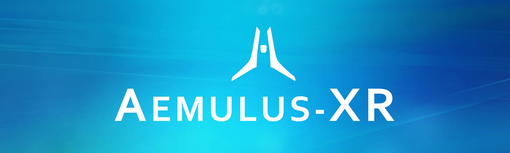

# AemulusConnect [](https://github.com/qoomon/starline)

<div align="center">



### Seamlessly transfer Aemulus XR reports from your Oculus Quest to your Windows PC

[](https://github.com/Aemulus-XR/AemulusConnect/graphs/contributors)
[](https://github.com/Aemulus-XR/AemulusConnect/commits/main)
[](https://github.com/Aemulus-XR/AemulusConnect/stargazers)
[](https://github.com/Aemulus-XR/AemulusConnect/issues/)
[](https://github.com/Aemulus-XR/AemulusConnect/blob/main/notes/LICENSE.md)
[](https://discord.gg/gQH4mXWQRT)

[Download](https://github.com/Aemulus-XR/AemulusConnect/releases) • [Documentation](notes/USER_GUIDE.md) • [Report Bug](https://github.com/Aemulus-XR/AemulusConnect/issues/new?template=bug_report.md) • [Request Feature](https://github.com/Aemulus-XR/AemulusConnect/issues/new?template=feature_request.md)

</div>

---

## What is AemulusConnect?

**AemulusConnect** is a Windows desktop application that makes it easy to transfer report files from your Oculus Quest VR headset to your PC. Built specifically for [Aemulus XR](https://www.aemulus-xr.com/) users, it automatically detects your Quest device, downloads your reports, and organizes them on your computer—all with just a click.

### Key Features

- 🔌 **Automatic Device Detection** - Instantly recognizes your Quest when connected
- 📥 **One-Click Downloads** - Fetch all reports with a single button press
- 📁 **Smart Organization** - Files saved to organized folders on your desktop
- 💾 **Automatic Archiving** - Keeps your Quest storage clean by archiving transferred files
- ⚙️ **Customizable Paths** - Configure where files are stored (both on Quest and PC)
- 🔄 **Real-Time Status** - Visual feedback during transfers with progress indicators
- 🛡️ **Secure & Private** - All transfers happen locally—no cloud, no external servers

## Quick Start

### For Users

1. **Download** the latest installer from [Releases](https://github.com/Aemulus-XR/AemulusConnect/releases)
2. **Install** by running the `.msi` file
3. **Connect** your Quest device to your PC via USB
4. **Enable USB Debugging** on your Quest (first time only)
5. **Click "Fetch Reports"** to download your files

📖 **Full user guide:** [USER_GUIDE.md](notes/USER_GUIDE.md)

### For Developers

```powershell
# Clone the repository
git clone https://github.com/Aemulus-XR/AemulusConnect.git
cd AemulusConnect

# Verify prerequisites
cd tools
.\verify_prerequisites.ps1

# Build the application
.\build-and-package.ps1 -Clean
```

🛠️ **Developer guide:** [CONTRIBUTING.md](notes/dev/CONTRIBUTING.md)

## System Requirements

- **Operating System**: Windows 10 (Build 26100+) or Windows 11
- **Runtime**: .NET 8 Desktop Runtime (installer will prompt if needed)
- **Device**: Oculus Quest or Quest 2 with USB debugging enabled
- **Connection**: USB cable

## Documentation

| Document                                             | Description                                                |
| ---------------------------------------------------- | ---------------------------------------------------------- |
| **[User Guide](notes/USER_GUIDE.md)**                | Installation, usage, and troubleshooting for end users     |
| **[Contributing Guide](notes/dev/CONTRIBUTING.md)**  | Developer setup, architecture, and contribution guidelines |
| **[Build Guide](notes/dev/BUILD.md)**                | Quick reference for building and packaging                 |
| **[Changelog](notes/dev/CHANGELOG.md)**              | Version history and release notes                          |
| **[Code of Conduct](notes/dev/CODE_OF_CONDUCT.md)** | Community guidelines and expectations                      |

## How It Works

AemulusConnect uses the Android Debug Bridge (ADB) to communicate securely with your Quest device:

1. **Detect** - Automatically finds your connected Quest
2. **Transfer** - Copies report files (PDF and CSV) from `sdcard\Documents\` to your PC desktop
3. **Archive** - Moves original files to `sdcard\Documents\Archive\` on your Quest
4. **Manage** - Automatically maintains the 100 most recent archived files

## Technology Stack

- **Language**: C# 12.0
- **Framework**: .NET 8.0 with Windows Forms
- **ADB Library**: AdvancedSharpAdbClient 3.4.14
- **Logging**: log4net 3.2.0
- **Installer**: WiX Toolset v4
- **Build System**: PowerShell automation scripts

## Contributing

We welcome contributions! Whether you're fixing bugs, adding features, improving documentation, or helping with testing:

1. 🍴 Fork the repository
2. 🌿 Create a feature branch (`git checkout -b feature/amazing-feature`)
3. 💾 Commit your changes (`git commit -m 'feat: add amazing feature'`)
4. 📤 Push to your branch (`git push origin feature/amazing-feature`)
5. 🔁 Open a Pull Request

See our [Contributing Guide](notes/dev/CONTRIBUTING.md) for detailed instructions.

## Support & Community

- 💬 **Discord**: [Join our community](https://discord.gg/Z6qhRUV6dh)
- 🐛 **Bug Reports**: [Open an issue](https://github.com/Aemulus-XR/AemulusConnect/issues/new?template=bug_report.md)
- ✨ **Feature Requests**: [Suggest a feature](https://github.com/Aemulus-XR/AemulusConnect/issues/new?template=feature_request.md)
- 🌐 **Aemulus XR**: [www.aemulus-xr.com](https://www.aemulus-xr.com/)

## Project Status

**Current Version**: 2.4.3
**Status**: Active Development
**Branch**: `main` (stable, deployed)

See [CHANGELOG.md](notes/dev/CHANGELOG.md) for version history and [TODO.md](notes/dev/TODO.md) for planned features.

## Credits & Acknowledgments

Copyright (c) 2025 Aemulus-XR  
This project is licensed under the **MIT License** - see [LICENSE.md](notes/LICENSE.md) for details.

**AemulusConnect** is built upon:

- **[ScooterGitTemplate](https://github.com/ScottKirvan/ScooterGitTemplate)** Copyright (c) 2024-2025 [Scott Kirvan](https://github.com/ScottKirvan) - Project template foundation
- **[AdvancedSharpAdbClient](https://github.com/yungd1plomat/AdvancedSharpAdbClient)** - ADB communication library
- **[log4net](https://logging.apache.org/log4net/)** - Copyright © 2007-2025 [The Apache Software Foundation](https://www.apache.org/) - Apache Logging Services
- **[WiX Toolset](https://wixtoolset.org/)** - Windows Installer XML toolset

### Project Maintainer

**Scott Kirvan**:
- GitHub: [@ScottKirvan](https://github.com/ScottKirvan)
- LinkedIn: [scottkirvan](https://www.linkedin.com/in/scottkirvan/)
- Discord: cptvideo

---

<div align="center">

**Made with ❤️ for the Aemulus XR community**

[⬆ Back to Top](#aemulusconnect)

</div>
